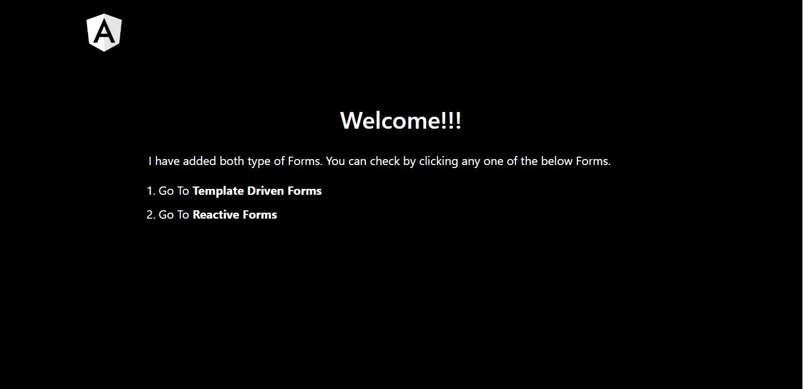
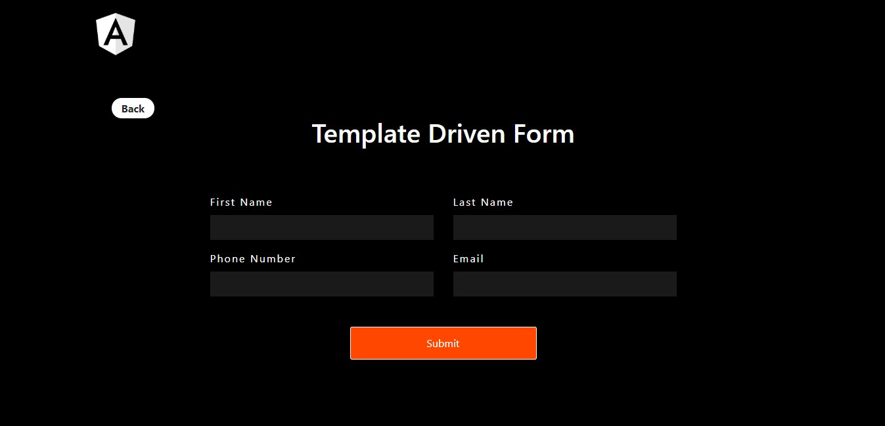
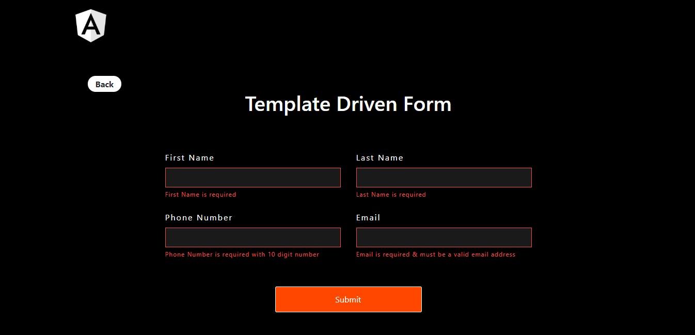
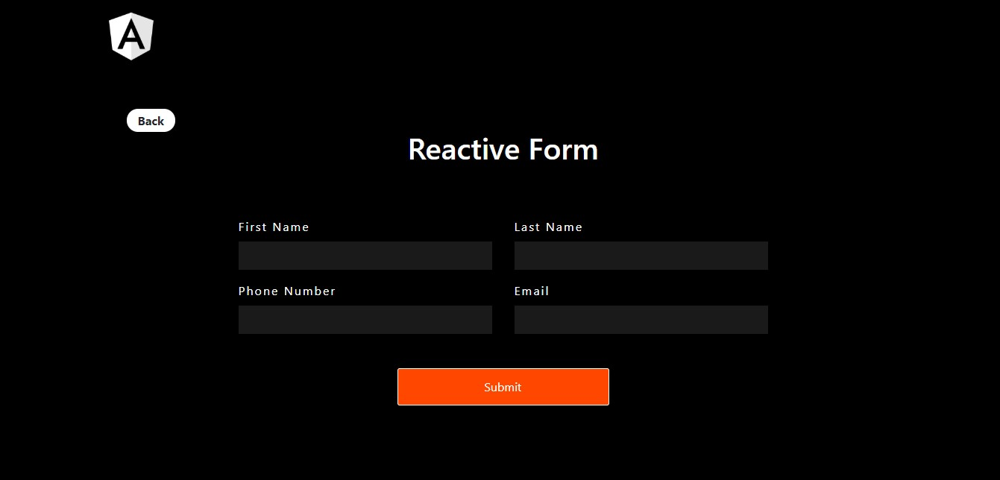
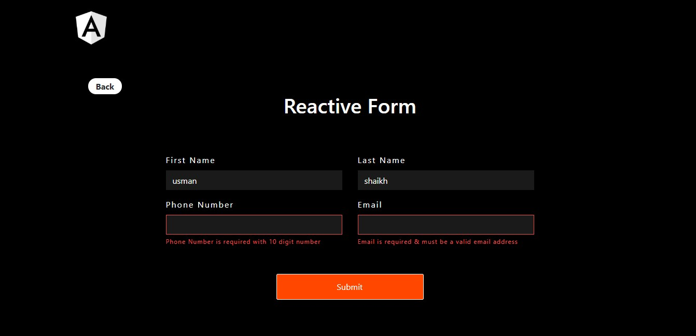

# Angular Form

Angular provide Two types of Form Template Driven Form & Reactive Form.

So I created two different Contact Form one by using Template Driven Form method

and

Another Contact Form by using Reactive Form method.

And also added Validation.

